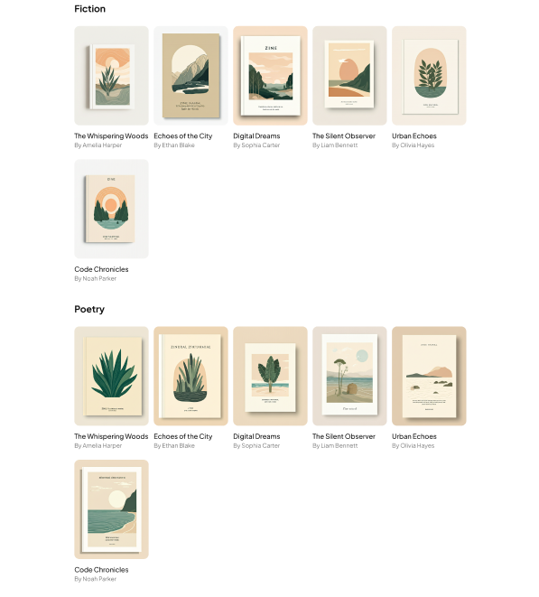

# InkVault
Personal Zine &amp; Micro-Journal Publishing App 

InkVault is a creative publishing platform designed to help writers, editors, and readers collaborate and share content in a seamless and intuitive way.

## 1. Design

The InkVault interface has been carefully designed with user experience in mind. Below are the major design screens based on our Figma prototype that guide the implementation of the frontend structure.

### Onboarding Screen

The onboarding screen introduces new users to InkVault’s value proposition in a focused and welcoming layout.

Key features:
- Friendly welcome message.
- Call-to-action: **"Next"** to continue setup or **"Skip"** to jump to dashboard.
- Clean, minimal layout emphasizing clarity and simplicity.

### Dashboard – "My Publications"

This is the user’s central hub showing all personal publications.

Key features:
- Visual thumbnails for each draft or published piece.
- Metadata: titles, short descriptions, and timestamps.
- Call-to-action button: **"Create New"** to open the editor quickly.
- Balanced, two-column layout designed for ease of use.

### Explore/Discover Page

This page allows users to browse and discover content from other authors.

Key features:
- Filter bar: sort by genre (e.g., Fiction, Poetry, Tech).
- Featured content carousel at the top.
- Grid layout showcasing each publication with tags, author info, and quick preview.

### Search Page

This screen provides a comprehensive search experience, allowing users to find content and other users.

Key features:
- A large, prominent search bar is at the top of the content area.
- Filter Tabs: The search results can be filtered by Publications, Users, and Topics.
- Search Suggestions: suggests recent and trending search terms to help users find what they're looking for more quickly.

### Editors Screen

This is the core creation tool for the platform, providing a clean and distraction-free interface for writing and publishing content.

Key features:
- Simple layout, with a main content area for the user to input their publication's title and content.
- A dedicated Preview panel on the right side of the screen shows a real-time rendering of the publication's cover, helping the user visualize the final product.
- Users have two main actions available: Save Draft and Publish, indicating a workflow that allows for saving work in progress before making it public.

### Publication View

This screen displays the full content of a selected publication, offering a clean and focused reading experience.

Key features:
- The publication's title and author are clearly displayed at the top. The publication date is also included.
- The main body of the screen is dedicated to the publication's text, presented in a clean, readable font.
- Interaction Bar: Below the main text, a horizontal bar provides user interaction options:
    . A heart icon for likes.
    . A comment icon.
    . A share/bookmark icon for shares or saves.

### Reading List - "My Lists"

This screen helps users organize and manage the content they are interested in.

Key features:
- Reading List Categories: The left side of the screen shows different reading lists, some of which are default (e.g., To Read, Completed, Favorites), and others are custom (e.g., Travel, Cooking).
- Publication Thumbnails: The right side of the screen displays a vertical stack of publications belonging to the selected reading list, represented by their cover images.
- A New List button is available to allow users to create their own custom reading lists.

### Notification Page

This screen aggregates all user-related updates and interactions in a single, easy-to-read list.

Key features:
- Notifications are presented in a chronological list, with the most recent at the top.
- Each notification includes the profile picture of the user who performed the action, adding a personal touch.
- Each item clearly describes the event i.e., "New comment," and the associated user or content.
- Timestamp:on the right side of each notification indicates how long ago the event occurred.

### Help/FAQ Page - "Help Center"

The help center is designed to be easy to navigate, providing quick answers to common questions.

Key features:
- A prominent search bar allows users to quickly find answers by searching for keywords.
- Categorized FAQs: Questions are organized into clear, collapsible sections:
    . Account Management (e.g., "How do I create an account?")
    . Publishing (e.g., "How do I publish a new work?")
    . Community Features (e.g., "How do I follow other users?")

### Settings Page - "Profile"

This screen allows users to customize their profile and account preferences.

Key features:
- Users can edit their Username and a descriptive Bio.
- Users have control over the platform's appearance with options for Light, Dark, and System themes. They can also adjust the font size to Small, Medium, or Large.
- Account Management: This section provides fields to manage the user's Email and Password, along with a button to Delete Account.